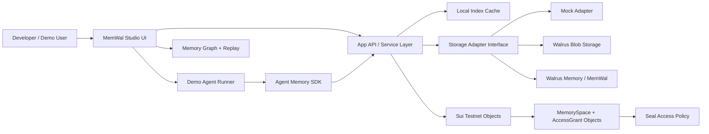
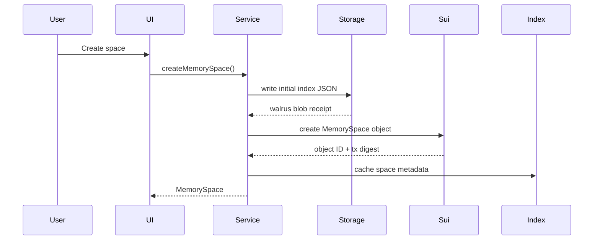
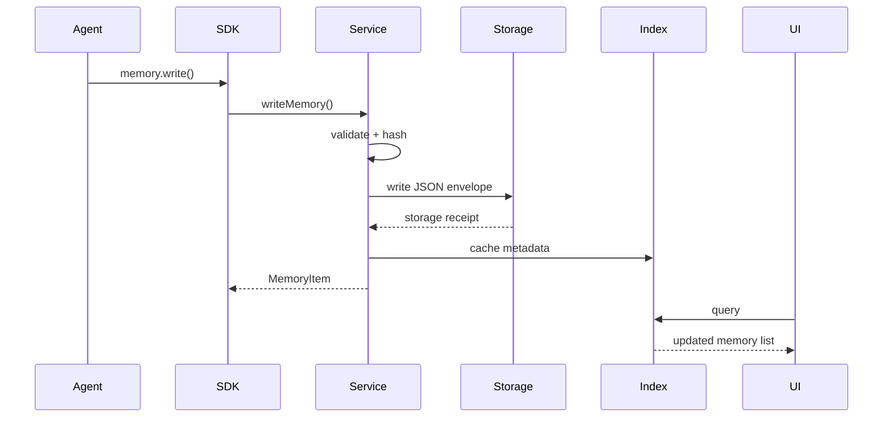
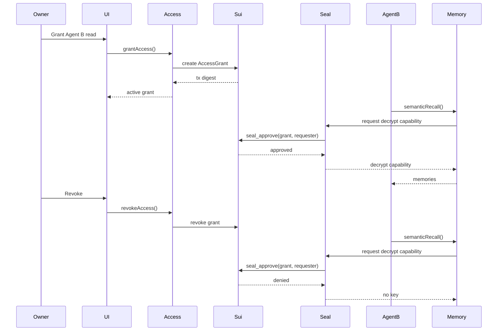
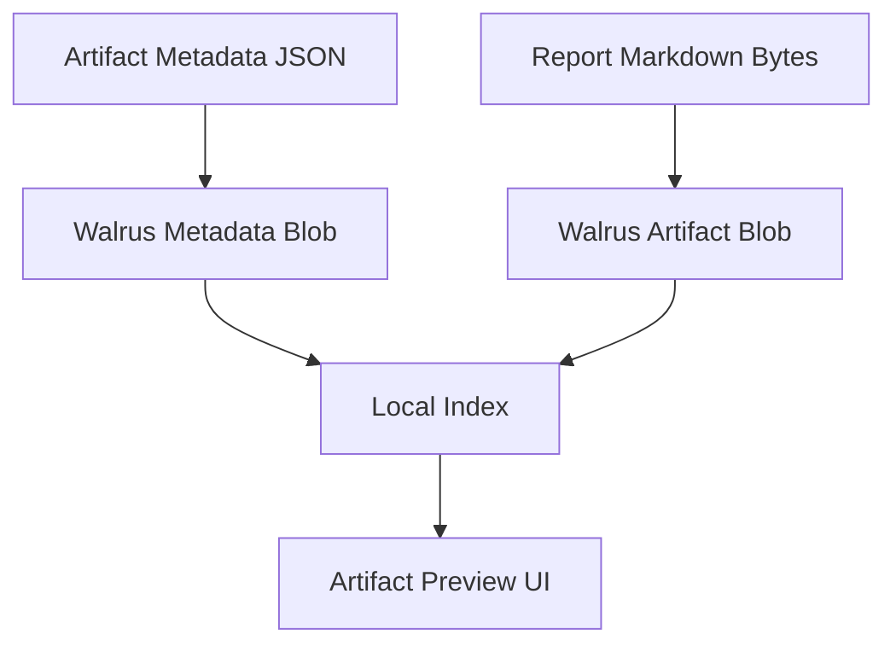

# MemWal Studio Architecture

## 1. Architecture Goals

MemWal Studio must prove that Walrus is not just passive storage. The architecture should show a complete agent memory operating layer:

- Agents produce memory and artifacts.
- Storage adapters persist them to Walrus / MemWal.
- A local index makes the UI fast.
- Sui objects govern memory namespace ownership and sharing.
- Seal-compatible policy checks enforce encrypted-memory access through Move `seal_approve`.
- The UI lets developers inspect, replay, and audit the workflow.

## 2. High-Level Diagram



## 3. Module Boundaries

### 3.1 UI Layer

Responsibilities:

- Render studio screens.
- Trigger demo agent runs.
- Show memory, artifact, graph, and replay state.
- Show storage mode and receipts.
- Never directly call Walrus or Sui low-level clients.

Key folders:

```text
src/app/
src/components/
src/features/spaces/
src/features/memory/
src/features/artifacts/
src/features/replay/
src/features/graph/
src/features/access/
src/features/demo/
```

### 3.2 Service Layer

Responsibilities:

- Validate input.
- Enforce access policy.
- Create content hashes.
- Call storage adapters.
- Update local index.
- Provide UI-friendly queries.

Key files:

```text
src/lib/services/memoryService.ts
src/lib/services/artifactService.ts
src/lib/services/runService.ts
src/lib/services/accessService.ts
src/lib/services/graphService.ts
```

### 3.3 Storage Layer

Responsibilities:

- Abstract storage providers.
- Support mock, Walrus, and MemWal modes.
- Return storage receipts.
- Verify hashes on read.

Key files:

```text
src/lib/storage/types.ts
src/lib/storage/mockStorageAdapter.ts
src/lib/storage/walrusStorageAdapter.ts
src/lib/storage/memwalStorageAdapter.ts
src/lib/storage/hash.ts
```

### 3.4 Agent SDK Layer

Responsibilities:

- Provide a simple API for agents.
- Record runs and events.
- Write memories.
- Attach artifacts.
- Reuse memory from a space.

Key files:

```text
src/lib/agent-sdk/memoryClient.ts
src/lib/agent-sdk/runRecorder.ts
src/lib/agent-sdk/demoAgents.ts
src/lib/agent-sdk/types.ts
```

### 3.5 Sui And Seal Layer

Responsibilities:

- Create memory namespace objects.
- Create access grants.
- Revoke access grants.
- Expose `seal_approve` so Seal can approve or deny decryption capability.
- Store tx digest and object IDs in app index.

Key files:

```text
move/memwal_studio/sources/memory_space.move
src/lib/sui/suiClient.ts
src/lib/sui/memorySpaceTx.ts
src/lib/sui/accessGrantTx.ts
src/lib/seal/sealClient.ts
src/lib/seal/envelope.ts
```

## 4. Data Flow

### 4.1 Create Memory Space



### 4.2 Agent Writes Memory



### 4.3 Multi-Agent Sharing



## 5. Storage Strategy

### 5.1 Why Use a Local Index

Walrus stores durable content, but the UI needs fast filtering, search, and joins. The local index is a cache, not a trust root.

Local index may store:

- IDs.
- Titles.
- Tags.
- Timestamps.
- Blob IDs.
- Hashes.
- Agent/run relationships.

Local index must not be the only copy of:

- Artifact bytes.
- Memory content.
- Final reports.
- Access proof references.

### 5.2 Storage Modes

#### Mock Mode

Use for local development and reliable demo fallback.

Properties:

- Deterministic receipts.
- No external network.
- Same interface as Walrus adapter.
- Clear UI badge: `MOCK`.
- Must not be used as the submission proof path.

#### Walrus Mode

Use for durable blob and artifact persistence.

Properties:

- Stores memory envelopes and artifact bytes.
- Returns blob IDs.
- Must verify content hash after read.

#### MemWal Mode

Use for agent-memory-specific operations when available.

Properties:

- Stores and retrieves memory records.
- May provide search and memory abstractions.
- Should still expose a receipt that can be shown in UI.
- Semantic recall should use MemWal retrieval where available, not keyword filtering.

### 5.3 Independent Verification

At least one memory or artifact must be independently verified:

1. Store payload through the Studio adapter.
2. Record content hash and blob or memory receipt.
3. Read payload through Walrus aggregator or equivalent independent path.
4. Recompute hash.
5. Store verifier output in `docs/aggregator-proof.json`.

## 6. Memory Envelope

Every memory item should be stored as an envelope.

```json
{
  "version": "1",
  "kind": "memwal_studio_memory",
  "spaceId": "space_123",
  "runId": "run_123",
  "agentId": "agent_research",
  "type": "observation",
  "title": "Memory portability problem",
  "content": "Agent memory is often locked into one runtime or vendor store.",
  "parents": [],
  "artifactIds": [],
  "tags": ["agent-memory", "portability"],
  "importance": 4,
  "visibility": "shared",
  "createdAt": "2026-06-14T12:00:00.000Z"
}
```

Hash canonical JSON before upload. Store the hash in the local index and UI.

## 7. Artifact Storage

Artifacts are stored as bytes, with metadata envelope stored separately.



## 8. Sui Object Model

The Move package should remain intentionally small.

Objects:

- `MemorySpace`: proves namespace ownership and points to initial Walrus index blob.
- `AccessGrant`: proves that an agent address has permission.

Events:

- `MemorySpaceCreated`
- `AccessGranted`
- `AccessRevoked`
- `SealApprovalChecked`

Why this matters:

- Walrus stores the data.
- Sui proves who controls the namespace.
- Seal uses the Sui policy outcome to release or deny decryption capability.
- The app can show tx digests, object IDs, policy checks, and approval/denial evidence as verifiable governance proof.

## 9. UI Architecture

Recommended layout:

```text
┌─────────────────────────────────────────────────────────────┐
│ Top Bar: Space selector | Storage mode | Wallet | Demo Run  │
├──────────────┬──────────────────────────────────────────────┤
│ Side Nav     │ Main Work Area                               │
│ Spaces       │                                              │
│ Runs         │ Split panels, tables, graph, replay          │
│ Memory       │                                              │
│ Artifacts    │                                              │
│ Graph        │                                              │
│ Access       │                                              │
└──────────────┴──────────────────────────────────────────────┘
```

Design style:

- Developer tool.
- Dense but organized.
- Use tables, split panes, badges, status dots, copy buttons.
- No marketing hero page.

## 10. Error Handling

Every service call returns typed errors:

```ts
type AppErrorCode =
  | "VALIDATION_ERROR"
  | "ACCESS_DENIED"
  | "STORAGE_WRITE_FAILED"
  | "STORAGE_READ_FAILED"
  | "HASH_MISMATCH"
  | "SUI_TX_FAILED"
  | "WALRUS_UNAVAILABLE"
  | "DEMO_AGENT_FAILED";
```

UI requirements:

- Display actionable message.
- Provide retry for storage writes.
- Provide fallback to mock mode where appropriate.
- Never silently lose memory writes.

## 11. Observability

For demo and debugging:

- Event log panel.
- Storage receipt panel.
- Failed write queue.
- Last Walrus operation.
- Last Sui tx digest.

This makes judging easier because the reviewers can see that real infrastructure is being used.

## 12. Deployment Architecture

Preferred hackathon deployment:

- Next.js app deployed on Vercel or similar.
- Optional server API route for Walrus writes if browser-only upload is awkward.
- Sui testnet package deployed from local CLI.
- Seal integration can run server-side if browser key handling is not appropriate.
- Environment variables:
  - `NEXT_PUBLIC_STORAGE_MODE`
  - `WALRUS_PUBLISHER_URL`
  - `WALRUS_AGGREGATOR_URL`
  - `NEXT_PUBLIC_SUI_NETWORK`
  - `NEXT_PUBLIC_MEMWAL_PACKAGE_ID`

## 13. Technical Risks

### Risk: Walrus integration takes longer than expected

Mitigation:

- Build adapter interface first.
- Mock mode has identical receipts.
- Integrate Walrus after product flow works.

### Risk: Project looks like a normal dashboard

Mitigation:

- Center demo on agent workflow.
- Show agent A to agent B memory reuse.
- Show Walrus IDs, replay, and access policy.

### Risk: Access control is only local

Mitigation:

- Implement minimal Move object and `seal_approve` early.
- If full Seal SDK integration is incomplete, label the flow as prototype and do not claim cryptographic revocation.
- The championship path must show Seal/Move policy approval before revoke and denial after revoke.

### Risk: Too much scope

Mitigation:

- Build in layers:
  1. Demo runner.
  2. Memory write/read.
  3. Timeline.
  4. Artifacts.
  5. Multi-agent sharing.
  6. Sui access object.
  7. Safety warnings.
